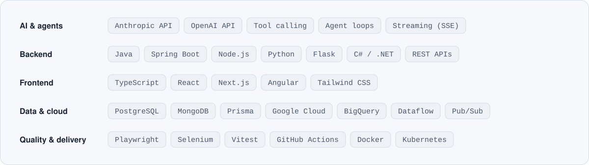

<picture>
  <source media="(prefers-color-scheme: dark)" srcset="assets/header-dark.svg">
  
</picture>

I've spent 18 years building production software: backend services, cloud data pipelines, web apps, and the test suites that keep them honest. I've shipped systems for healthcare, finance, banking and SaaS.

Now I build AI agents. These are LLM apps that call real tools, make decisions you can audit, and fail safely when the model gets it wrong.

## Featured work

### [Agentdeck](https://github.com/s-talha/agentdeck)

Build AI agents with tools, run them, and watch every step they take. Each model turn and tool call streams in live, and every run is saved as a replayable trace.

`Next.js` `TypeScript` `PostgreSQL` `Prisma` `Auth.js` `Server-Sent Events` `Playwright`

### [AI Support Ticket Triage Agent](https://github.com/s-talha/support-triage-agent-source)

Reads incoming support tickets, classifies them with an LLM, and decides whether to answer automatically or hand off to a person. The routing rules are plain code, not the model, so they can be tested and audited. If classification fails, the ticket goes to a human by default.

`Python` `Flask` `Anthropic` `OpenAI`

## How I build

- **The model suggests, code decides.** LLMs classify and draft. Anything with real consequences goes through rules you can read and test.
- **Every run is traceable.** You should be able to open any answer and see the steps, tool calls and inputs behind it.
- **It runs without keys.** My projects include a demo mode, so anyone can clone and try them in a minute.
- **Tested like production.** Unit tests for the logic, end-to-end tests for the flows, CI on every push.

## Stack

<picture>
  <source media="(prefers-color-scheme: dark)" srcset="assets/stack-dark.svg">
  
</picture>

## Get in touch

Based in Stockholm and open to new projects and roles, remote or on site. The easiest way to reach me is through any of my repositories.
